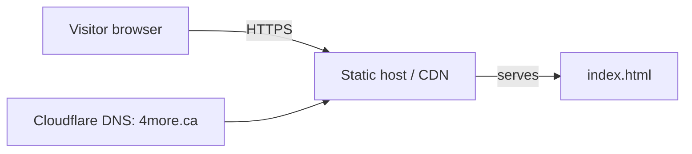

# 4more Coming Soon — Deployment

_As of 2026-05-19 · maintained per Samar AI White Glove standard_

This repo is a single static `index.html` "Coming Soon" landing page for **4more.ca**. There is no build step, no backend, no database, no runtime dependencies.

## Architecture at a glance



No deployment surfaces (Vercel/Netlify/Cloudflare Pages/Render/Docker/EAS) are configured in this repo as of the scan date. The site is presumed to be served by whichever host is pointed at `4more.ca` — see NEEDS SAMAR.

## Production surfaces

| Surface | Target | Host / URL | Notes |
|---|---|---|---|
| Static landing page | `index.html` | `https://4more.ca` (presumed) | No host config committed. Hosting platform: ⚠️ NEEDS SAMAR |
| DNS | `4more.ca` | Cloudflare (per Samar default stack) | ⚠️ NEEDS SAMAR — verify in Cloudflare dashboard |

## Environment variables (inventory only — values redacted)

None. The page is fully static with no env-dependent behavior.

## Deploy procedure

### Static site

Because there is no committed deploy config, deployment depends on whichever host Samar has wired to `4more.ca`. Best-fit defaults from the Samar stack:

**Option A — Cloudflare Pages (recommended for static, free, on Samar stack):**
1. In Cloudflare dashboard → Pages → Connect to Git → select `Samar-org/4more-coming-soon`.
2. Build command: _(none)_
3. Build output directory: `/` (repo root contains `index.html`).
4. Production branch: `main`.
5. Add custom domain `4more.ca` (and `www.4more.ca`).

**Option B — Vercel (also on Samar stack):**
1. Import repo in Vercel.
2. Framework preset: **Other**. Output directory: `./`.
3. Attach `4more.ca` custom domain.

Any push to `main` redeploys automatically under either option.

### Backend / Mobile

N/A — none in this repo.

## Rollback procedure

1. Identify the last good commit on `main`: `git log --oneline`.
2. Revert via Git:
   ```bash
   git revert <bad-sha>
   git push origin main
   ```
   The host (Pages/Vercel) will rebuild from `main` automatically.
3. Or, in the host dashboard, promote a prior deployment to production (Cloudflare Pages: "Rollback"; Vercel: "Promote to Production" on the prior deployment).

## DNS (Cloudflare)

- Apex: `4more.ca` → host of choice (Cloudflare Pages or Vercel).
- `www.4more.ca` → same target.

⚠️ NEEDS SAMAR — verify against actual Cloudflare dashboard. Confirm whether the apex is currently proxied (orange cloud) or DNS-only.

## Phase 1 (Build) status

- [x] Static landing page committed (`index.html`)
- [x] Public repo (intentional — marketing/coming-soon page)
- [ ] Hosting platform documented in this repo
- [ ] Custom domain confirmed live

## Phase 2 (Go-Live Hardening) status

Minimal surface — most hardening items are N/A for a static no-secret page, but for completeness:

- [ ] HTTPS enforced at host (default on Cloudflare Pages / Vercel)
- [ ] HSTS enabled at host or Cloudflare
- [ ] Cloudflare WAF/Bot Fight Mode considered
- [ ] Branch protection enabled on `main`
- [ ] Confirm no analytics / tracking scripts leak data (currently: none in `index.html`)

## NEEDS SAMAR

1. Which host is actually serving `4more.ca` today (Cloudflare Pages? Vercel? Other?) — once known, add the URL to "Production surfaces" and remove this ambiguity.
2. Confirm Cloudflare DNS record for `4more.ca` apex + `www`.
3. Decide whether this static page is the long-term home for `4more.ca` or a temporary placeholder pointing to the real Next.js multi-subdomain platform from the 4more Corporation stack.
4. Enable branch protection on `main` if this page is the live production landing.
5. Add a favicon and OG/Twitter meta tags before treating this as "production marketing-ready."

---
Built with Samar AI White Glove — idea to live in minutes, hardened at go-live, documented to last.
